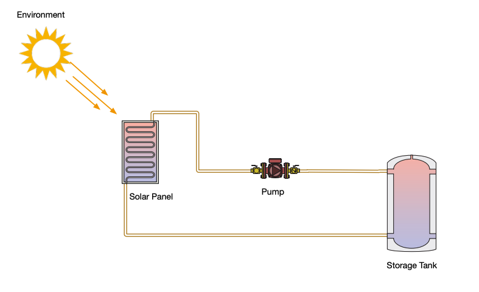

# Solar Thermal System Simulation

Author: Curtis Casados

## To Run

From the project directory, to start the app run the following command:

### `npm install && npm start`

note: these commands can be run seperate if preferred

Runs the app in the development mode.\
Open [http://localhost:3000](http://localhost:3000) to view it in your browser.

Once running, the app can be accessed from the browser to display a UI and dashboard of relevant temperature information. Pressing the "Simulate" button will kick off a simulation of heat transfer for a specified time step and calculate T_out (T_hot) of the solar panel, determine the temperature of the tank after mixing and continue simulating until target temperature is reached. Then the app will proceed to display a graph of the simulated heat transfer and temperature results.

Ultimately, we are simulating time passing and the resulting temperature of the heat transfer from the solar panel to the water and then mixing with the initial temperature (room temp) water in the storage tank and displaying the finalized mixed water temperature of solar and tank. Stopping only when we reach the desired target temperature.

The app is responsive to screen size execpt for mobile due to the fixed sidebar. This is an improvement for the future.

## Problem

Simulate the heat transfer from a solar panel to a storage tank given the following diagram:

## Approach

To constrain the problem, several assumptions were made to narrow the focus of solving the heat transfer from solar panel to water. These constraints allow us to focus on determining the temperature after the water has heated up due to the solar irradiation captured by the thermal solar panel. Using averages and values found from research. Solving for the T_out of the solar panel allows us to simulate a real life scenario where we care about usable hot water from a sustainable source such as the sun. We are able to model a simplified version of the system for a proof-of-concept and prototype. This web app produces a graph of simulated heat transfer of the system and returns and array of data points with Temperature and various statistics thatis displayed on the UI. The temperature data points displayed is the temperature after mixing with the storage tank for that time step.

## File Stucture

- /utils: folder containing simulation function, helper functions and constants
- /src: folder contains the React UI for this simulation app
- /src/App.js: files is the entry point for the React UI
- /src/components: folder contains the React UI components for this simulation app

## Assumptions

- Ambient and optimal environment
- Perfectly insulated pipes (no loss)
- Perfectly insulated storage tank (no loss)
- Uniform mixing of hot and cold water in tank (average T)
- Storage tank capacity of 500 Liters and full of 20&deg;C water
- 1 Liter of water = 1kg, so 500 Liter tank is 500 kg of water
- Fluid in system is water
- Power considerations for solar panel, pump and tank neglected
- Pump dynamics neglected - assumed to simply circulate water
- Thermal Solar Panel Efficiency of 70% [Citation 1]
- Solar Panel ideal black box and operating at optimal angle
- Constant solar irradiation Q value of 1000 W/m^2
- Solar Panel area is 1m^2
- Constant flow rate of 0.0630902 liter/sec (avg. for solar pump)

## Equations Used

Calculate the Power [Watts] generated by the solar panel. Where we have values for $\eta$, $G\_{irr}$, and $A$ of the solar panel.

$$ P = \eta G\_{irr} A $$

Once we have Power, we can calculate the amount of Energy [Joules] using:

$$ E = P \times t $$

where $P$ is the power from above, and $t$ is time.

Next, we know the thermal solar panel heats the absorber plate/pipe which then heats the fluid (water) using conduction.

$$ Q = mc\Delta T $$

After calculating $E$, we can use this and rearrange the conduction heat transfer equation to solve for $T_{hot}$ (hot water out of the solar panel). We rearrange and substitute $E$ for $Q$, as they are both energy, and are solving the equation:

$$
T_{hot} = \frac{Q}{mc} + T_{cold}
$$

Once we have the $T_{hot}$ from the outlet of the thermal solar panel, we will calculate the average temperature of the tank as the value to be returned and displayed, as we are assuming homogeneous mixing. Ultimately, taking the average, we get our final temperature result as:

$$
T_{final} = \frac{T_{hot} + T_{prev/cold}}{2}
$$

## Resources

- [Citation 1] - https://www.viridiansolar.co.uk/resources-3-2-efficiency-of-solar-thermal-panels.html#:~:text=The%20ratio%20of%20the%20light,%22zero%2Dloss%20efficiency%22.

- [Citation 2] - https://caas.usu.edu/weather/graphical-data/solar-radiation

### Packages Used:

- recharts.js
- tailwind css

## Next Steps / Continuation of Work

### Further Model System:

- Better model Solar Irradiance (Q) based on region, time of day, season and other environmental factors (appears as bell-curve) [Citation 2]
- Better model Solar Panel specifications and heat transfer -> angle of panel, cloudy day, temperature, etc.
- Fluid Dyanmics and relation to heat transfer
- Modele heat loss through pipe, storage tank, pump, and valve connections
- Power consumption of Pump
- Size and spec. pump for optimal fluid flow through solar panel
- More accurately model mixing of hot and cold water in storage tank
- Model hot water being used and cold water replacing in tank/system

### Further Simulate Scenarios and Improve App

- Simulate end user producing a draw on the system (using hot water)
- Simulate heat loss that automatically triggers turning on of pump to replenish water in tank (cold water)
- Validate using unit tests and comparing with real data comparing errors and making necessary improvements
- Integrate control into the system (i.e. PID) for autonomous abilities
- The main simulation function (~/simulate.js) could be extracted and run on a server for better performance and accessed via an API

- Sensors

  - Build API for real-time Q value from a pyranometer sensor
  - Apply multiple heat sensors at strategic locations to better model tempature (i.e. inlet/outlet of solar panel, inlet/outlet of tank, end user outlet like sink)
  - Add sensors to pump to monitor and measure power usage

- Web App Improvements
  - Add Pan and Zoom functionality to LineGraph plot
  - Make app more responsive and include collapsible sidebar
